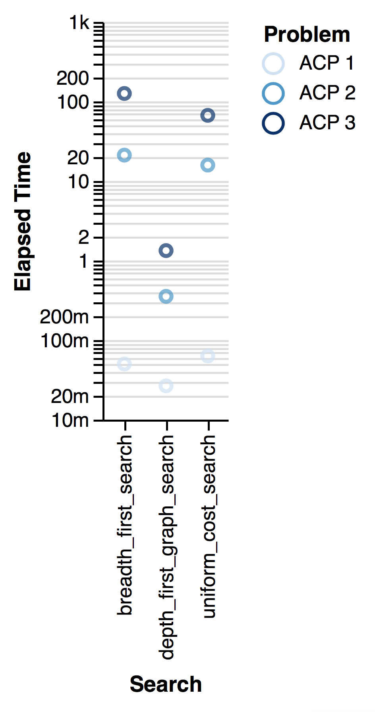
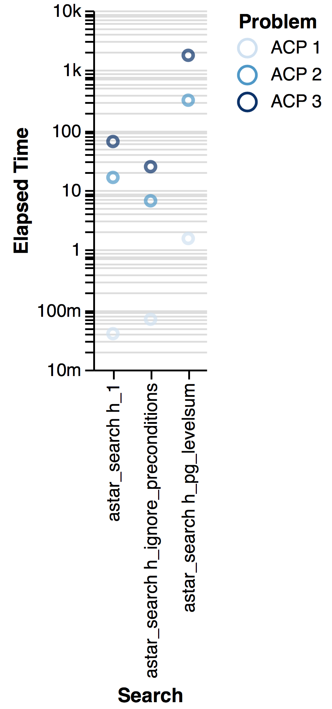

# Heuristic Analysis 

__Provide an optimal plan for Problems 1, 2, and 3.__

    Solving ACP 1 using breadth_first_search...

    Expansions   Goal Tests   New Nodes
        43          56         180    

    Plan length: 6  Time elapsed in seconds: 0.0422343909740448
    
    Load(C1, P1, SFO)
    Load(C2, P2, JFK)
    Fly(P2, JFK, SFO)
    Unload(C2, P2, SFO)
    Fly(P1, SFO, JFK)
    Unload(C1, P1, JFK)

    Solving ACP 2 using astar_search with h_ignore_preconditions...

    Expansions   Goal Tests   New Nodes
        4853        4855       44041   

    Plan length: 9  Time elapsed in seconds: 16.03822832100559
    
    Load(C1, P1, SFO)
    Load(C2, P2, JFK)
    Load(C3, P3, ATL)
    Fly(P1, SFO, JFK)
    Fly(P2, JFK, SFO)
    Fly(P3, ATL, SFO)
    Unload(C3, P3, SFO)
    Unload(C2, P2, SFO)
    Unload(C1, P1, JFK)

    Solving ACP 3 using astar_search with h_ignore_preconditions...

    Expansions   Goal Tests   New Nodes
       18223       18225       159618  

    Plan length: 12  Time elapsed in seconds: 68.17411388404435
  
    Load(C1, P1, SFO)
    Load(C2, P2, JFK)
    Fly(P1, SFO, ATL)
    Load(C3, P1, ATL)
    Fly(P2, JFK, ORD)
    Load(C4, P2, ORD)
    Fly(P2, ORD, SFO)
    Fly(P1, ATL, JFK)
    Unload(C4, P2, SFO)
    Unload(C3, P1, JFK)
    Unload(C2, P2, SFO)
    Unload(C1, P1, JFK)

__Compare and contrast non-heuristic search result metrics (optimality, time
elapsed, number of node expansions) for Problems 1,2, and 3. Include
breadth-first, depth-first, and at least one other uninformed non-heuristic
search in your comparison; Your third choice of non-heuristic search may be
skipped for Problem 3 if it takes longer than 10 minutes to run, but a note in
this case should be included.__

When running `breadth first search (1)`,  `depth first graph search (3)` and  `uniform-cost-search (5)` on all three problems we see the following results:

Prob|Search|t (s)|#|N. Exp.|G. Tests|New N.
   - |  -     |  -         |    -        |     -         |   -      |   -
ACP 1|breadth_first|0.05|6|43|56|180
ACP 1|depth_first_graph|0.03|20|21|22|84
ACP 1|uniform_cost|0.06|6|55|57|224
ACP 2|breadth_first|21.20|9|3346|4612|30534
ACP 2|depth_first_graph|0.36|105|107|108|959
ACP 2|uniform_cost|15.61|9|4853|4855|44041
ACP 3|breadth_first|122.78|12|14120|17673|124926
ACP 3|depth_first_graph|1.36|288|292|293|2388
ACP 3|uniform_cost|65.68|12|18223|18225|159618

When looking at the results it becomes fairly obvious that depth-first search stands out from the others. 

As it expands one path at a time, and does so until
it reaches a valid goal, any valid goal, or backtracks and then expands until it reaches a goal it
doesn't need much state to keep track off. Therefore it comes up with a result
quickly without looking at a large part of the problem space.

The other two approaches come up with an optimal solution in contrast, but need
more time and space to evaluate the problem space.

__Compare and contrast heuristic search result metrics using A-Star with the "ignore
preconditions" and "level-sum" heuristics for Problems 1, 2, and 3.__

Looking at the specific issue of planning the cargo flights we can make use if
the independence of the goals, therefore levelsum was applicable.

When running the three different heuristics we are presented witht the
following results for our three problems:

Prob|Search|t (s)|#|N. Exp.|G. Tests|New N.
   - |  -     |  -         |    -        |     -         |   -      |   -
ACP 1|1|0.04|6|55|57|224
ACP 1|ignore_preconditions|0.07|6|41|43|170
ACP 1|pg_levelsum|1.55|6|11|13|50
ACP 2|1|16.19|9|4853|4855|44041
ACP 2|ignore_preconditions|6.48|9|1450|1452|13303
ACP 2|pg_levelsum|319.86|9|86|88|841
ACP 3|1|64.73|12|18223|18225|159618
ACP 3|ignore_preconditions|24.95|12|5040|5042|44944
ACP 3|pg_levelsum|1811.00|12|315|317|2902

As expected as even the dummy heuristic `h_1` is admissable we get an optimal result
from all three heuristics.

However we can then further see the efficiency of a relatively domain-stupid
heuristic, `h_ignore_preconditions`, that was applicable because the goals in our cargo planning were
independent and therefore relaxing the constraints was admissable.

Also we were able to see that the `h_pg_levelsum` was performing much better in
terms of accuracy, i.e. lower unneeded expansion into the problem space, but this accuracy came at the price that half of the problem was
already solved during the heuristically approximation.

So it seems this is a case where legwork pays off instead of cleverness.

__What was the best heuristic used in these problems? Was it better than
non-heuristic search planning methods for all problems? Why or why not?__

The heuristic search planning methods were the clear winner. It was further
interesting to see that an elaborate heuristic, while more accurately guiding
the search process, was overall not as efficient as a relatively dumb
heuristic, that exploits not domain knowledge, but structural knowledge of how
the problem was expressed, i.e. here dropping the pre-conditions. 
